#利用工具生成并配置iOSApp的图标与LaunchImage
###一.在App下载Prepo   
首先打开AppStore,下载Prepo  
   
 然后打开软件是这样的  
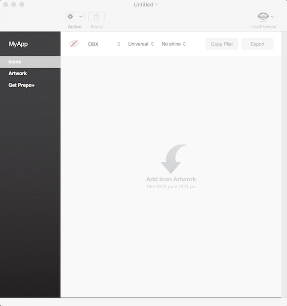  
选择一张图片,拖进中间剪头指向的位置,图片就已经生成了,点击右上角的Export按钮,即可保存所有生成的图  
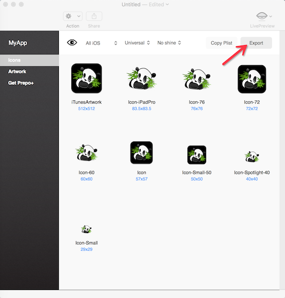   
确保在指定路径下有生成所有尺寸的图片,那么接下来开始做下一步操作吧.  
###二.在Xcode中进行设置与操作  
#####(1)设置应用程序的图标(Appicon)  
打开xcode,找到Assets.xcassets文件夹(这个文件夹是专门设置Appicon和LaunchImage启动页的)
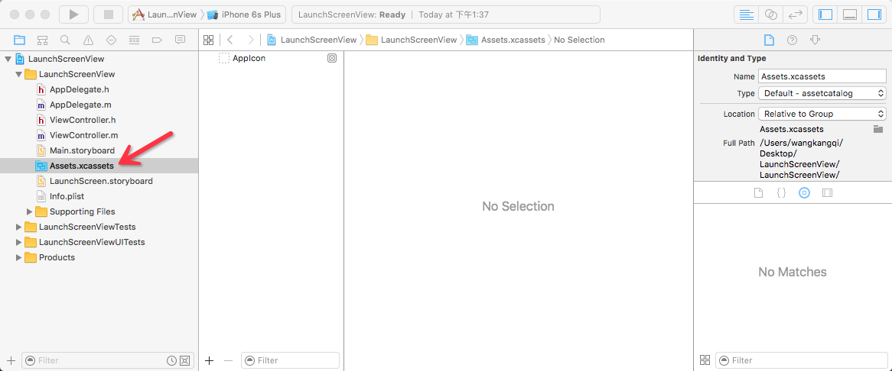  
然后点击中间的Appicon,点击delete,删除系统自带的Appicon文件夹  
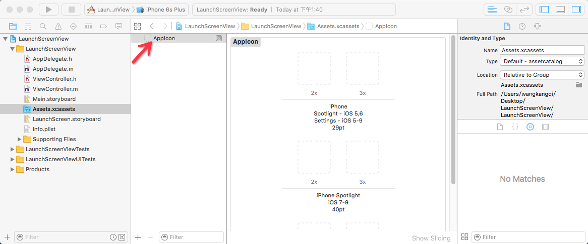   
新建一个新的Appicon文件夹  
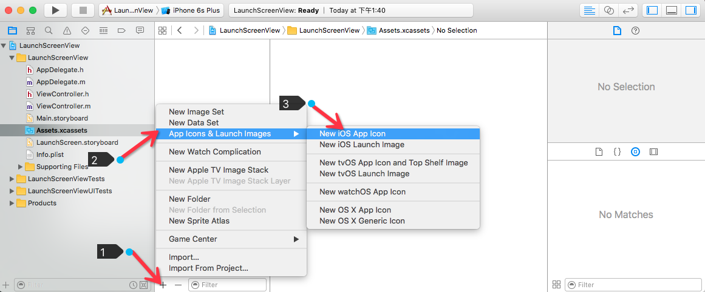  
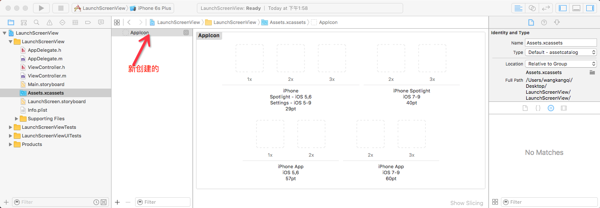  
打开存储路径下生成的appicon图标  
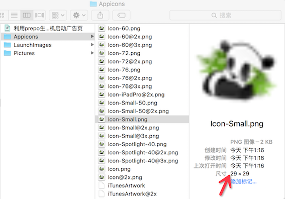 
将图标拖到指定的位置,如图  
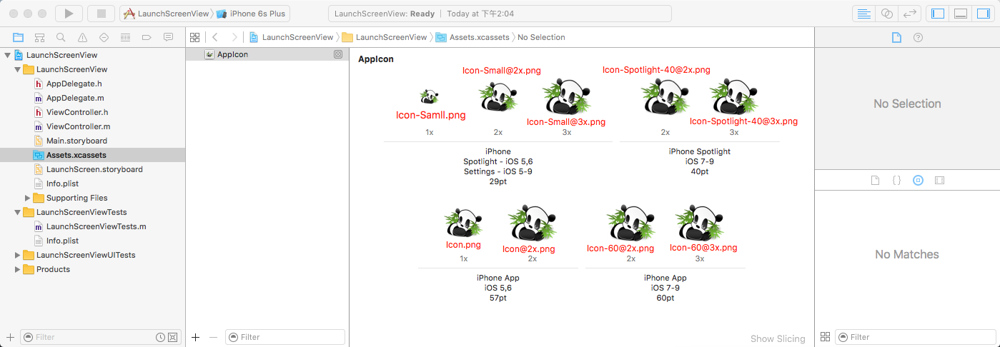  
还没完,点击target按照图示方向找到该位置  
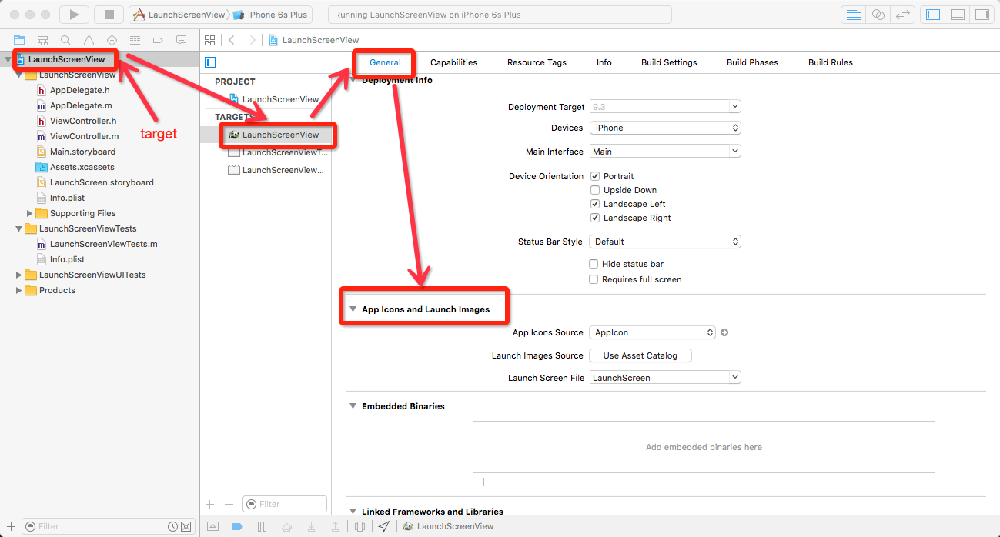 
选择我们刚刚在Assets.xcassets创建的那个AppIcon文件夹  
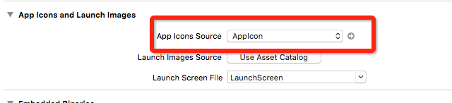  
然后运行即可看到我们添加的图标
#####(2)设置应用程序的开机启动图(LaunchImage)  
同理,使用Appicon and Launchimage Maker可以生成AppIcon也可以生成launchImage  
具体步骤根据以下链接进行操作   
首先打开你的电脑上的AppStore,然后搜索:AppIcon  
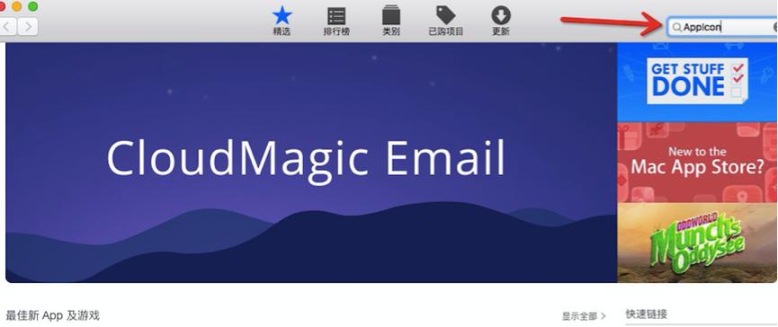 
然后回车:  
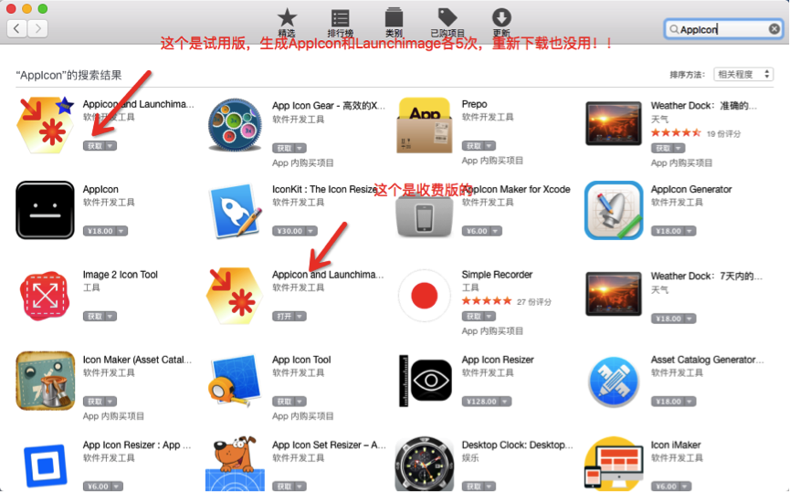  
这里我们先使用免费版的点击下载(左上角的那个)  
然后打开软件.是这样的:  
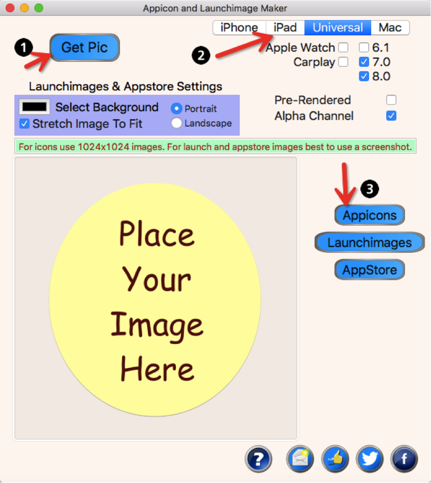  
1是选图片2是选择要给什么设备以及iOS几做3.选择生成AppIcon还是LaunchImages(启动页),然后同理可以得到我们需要的开机启动图  
打开Xcode,按照图示操作  
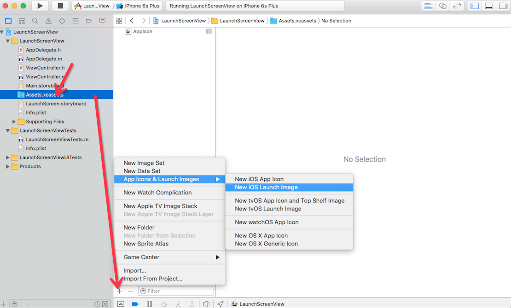  
然后将新的图标拖进工程中即可  
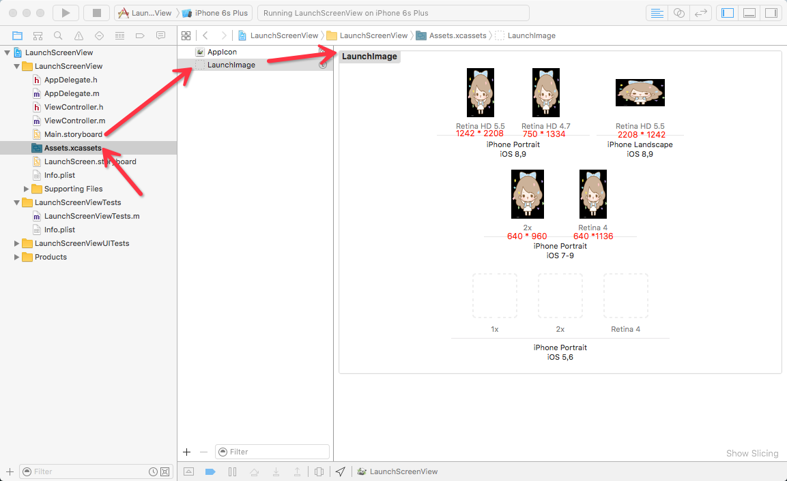  
然后点击target,找到  
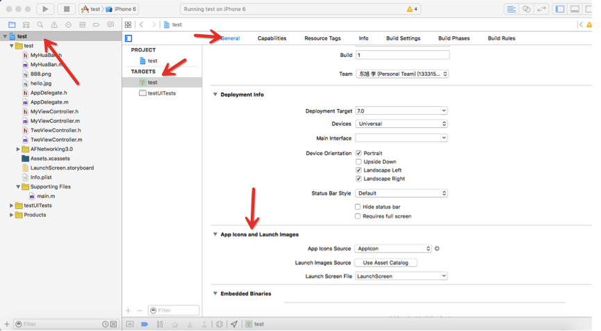   
现在我们要设置的是这个,点击  
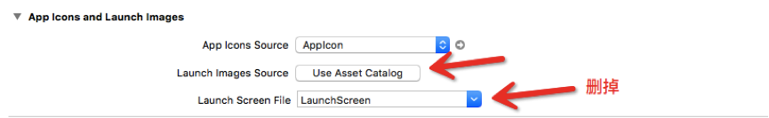 
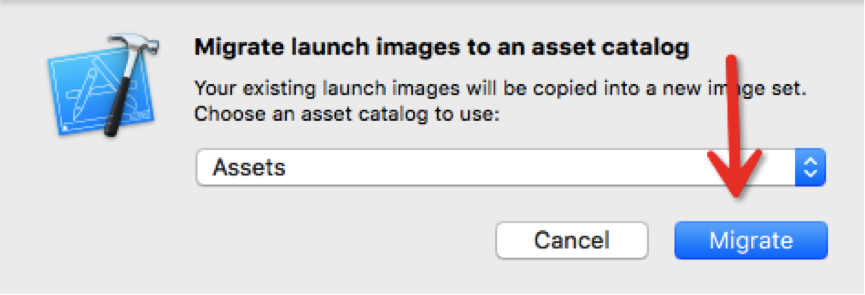 
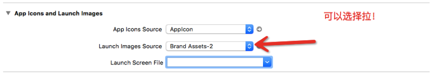 
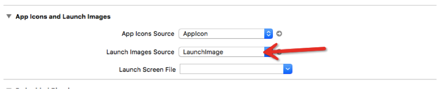   
直接选择就可以,然后运行程序.如果说是没有运行效果,则需要重置模拟器,选中模拟器之后在屏幕左上角菜单  
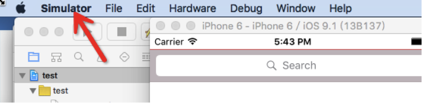 
选择第三项Reset Content and Settings.等待模拟器重置完成后,重新启动工程即可看到效果.
###原文链接  
1.[参考链接](http://www.jianshu.com/p/e7e0cabdc6a7)

